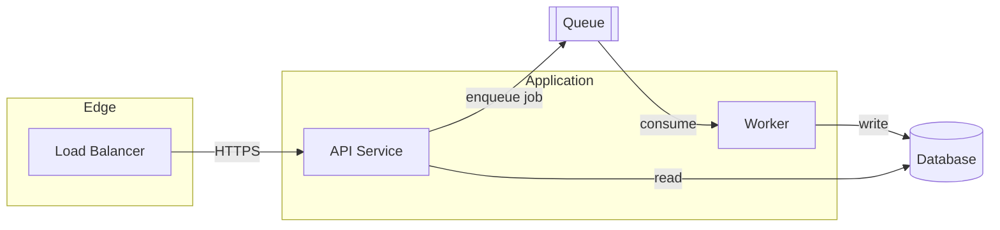
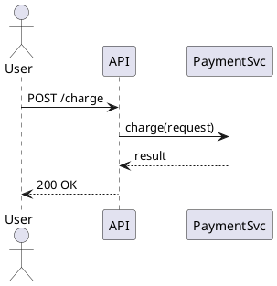

# Architecture Diagram

Good architecture diagrams make **one argument clearly**. Before drawing, decide
the argument, pick a pattern that carries it, choose the lightest tool that can
render it well, then iterate on quality. **Layout first, connect second, color
last.**

## Step 1: Pick the Tool

Match the tool to how much control and polish you need. Prefer diagram-as-code
(diffable, versionable, regenerable) unless you need pixel-level editorial control.

| Tool | Strengths | Use when | Avoid when |
|------|-----------|----------|-----------|
| **Mermaid** | Renders in Markdown/GitHub/docs, zero setup, easy diffs | Flowcharts, sequence, ER, most docs diagrams | You need precise layout or custom visuals |
| **Graphviz / DOT** | Excellent auto-layout of large graphs, deterministic | Dependency graphs, call graphs, many-node topologies | Sequence diagrams; fine-grained styling |
| **PlantUML** | Rich UML (sequence, component, deployment), text-based | Formal UML, detailed sequence diagrams | Lightweight README sketches |
| **Hand-authored SVG** | Total control of layout, color, typography | Editorial/marketing-grade figures, blog/hero diagrams | Anything you'll edit often or auto-generate |

Rule of thumb: **docs → Mermaid; big auto-laid-out graphs → Graphviz; formal UML
→ PlantUML; a polished one-off figure → SVG.**

## Step 2: Pick the Pattern

Choose the pattern from the *argument the diagram makes*, not from the tool.

| Intent | Pattern |
|--------|---------|
| Sequence of steps | Linear workflow (L→R) |
| Retries / iteration | Feedback loop (main path + one return edge) |
| Decisions / branching | Branch tree (≤4 balanced branches) |
| Before/after | Split comparison (mirrored panels) |
| System boundaries / components | Grouped architecture (containers + nodes) |
| Abstraction layers | Layered stack (T→B bands) |
| Actors over time | Swimlane sequence (2–5 lanes) |
| Central concept + supporters | Hub-and-spoke |
| Concurrent workers | Parallel fan-out / fan-in |

## Step 3: Spec Before You Draw

Write a short plan first — it prevents rework:

```
Title:            <the one claim>
Tool:             Mermaid | DOT | PlantUML | SVG
Pattern:          <from table above>
Reading order:    L→R | T→B
Nodes:            <name → role/type>
Groups/Layers:    <containers, if any>
Edges:            <source → target : label>
Edge budget:      ≤5 cross-group edges, ≤2 line styles
```

## Step 4: Draw It

### Mermaid (default for docs)



### Graphviz / DOT (large graphs)


Render: `dot -Tsvg arch.dot -o arch.svg` (or `-Tpng`).

### PlantUML (formal UML / sequence)



### Hand-authored SVG (editorial figures)

Only when polish justifies the effort. Build the SVG programmatically (assemble
lines → join → write file) so it's regenerable. Structure and layout rules:

- **Z-order:** background → containers → edges → edge-label backgrounds → nodes → text → legend.
- Define arrow markers once in `<defs>`; never inline per-edge.
- Inline any icons as SVG paths; never `@import url()` for fonts/icons (breaks offline/standalone rendering).
- ≥80px spacing between nodes; orthogonal edge routing; connect at midpoints.
- Node content: **bold name** + regular technical detail (+ optional param line).
- Edge labels are specific: `POST /charge`, `read(userId)` — never "sends"/"process".

## Step 5: Enforce Quality

Universal rules regardless of tool:

- **One dominant idea per diagram.** Reading order obvious within ~3 seconds.
- **Whitespace separates before boxes do.** Don't box everything.
- **Budgets:** ≤20 nodes, ≤4 accent colors, ≤3 nesting levels, ≤5 cross-group
  edges, ≤2 line/dash styles.
- **Reduce edges before routing them.** If a diagram is a tangle, the fix is
  usually *fewer edges* (replace a fan-out with one labeled annotation), not
  cleverer routing.
- **Consistent semantics:** one color/line-style = one meaning. Add a legend
  once you use 2+ edge types or colors.
- Keep caveats/assumptions in the surrounding prose, not as footnotes on the canvas.

## Step 6: Validate the Render

- **Code tools:** render to SVG/PNG and confirm it compiles (`dot -Tsvg …`,
  Mermaid CLI `mmdc`, PlantUML jar). A diagram that doesn't render is worthless.
- **SVG:** validate with a converter (e.g. `rsvg-convert file.svg -o /dev/null`),
  then export a PNG and *look at it*. Check: no text overlap/clipping, no
  crossing edges that could be avoided, spacing holds, layer/group labels fully
  visible, legend present if needed. Fix and re-export; iterate a few times.

## Tips

- **Decide the one claim first.** A diagram that argues two things argues neither.
- **Reach for Mermaid/DOT before SVG.** Diagram-as-code is diffable and regenerable; only hand-author SVG when editorial polish truly pays off.
- **Layout first, connect second, color last** — and cut edges before you optimize their routing.
- **One color/line-style = one meaning.** Inconsistent encoding reads as noise.
- **Always render and eyeball the output.** Auto-layout and hand SVG both produce overlaps you won't catch by reading the source.
- **Stay within the budgets** (≤20 nodes, ≤4 colors, ≤3 nesting, ≤5 cross-group edges) — over-budget diagrams are the ones nobody can read.
